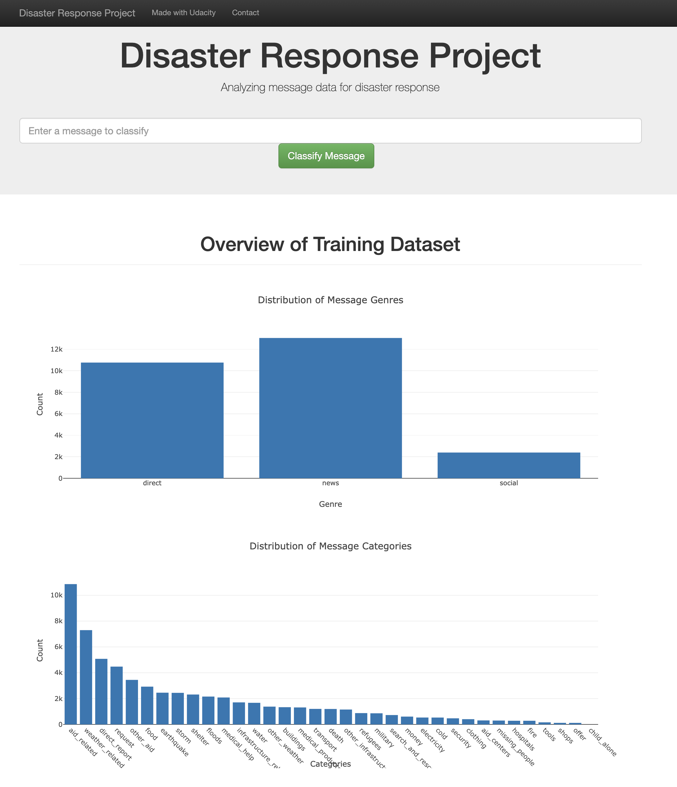

# Disaster Response Pipeline Project

### Table of Contents

### Instructions:
1. Run the following commands in the project's root directory to set up your database and model.

    - To run ETL pipeline that cleans data and stores in database
        `python data/process_data.py data/disaster_messages.csv data/disaster_categories.csv data/DisasterResponse.db`
    - To run ML pipeline that trains classifier and saves
        `python models/train_classifier.py data/DisasterResponse.db models/classifier.pkl`

2. Run the following command in the app's directory to run your web app.
    `python run.py`

3. Go to http://0.0.0.0:3001/

### Project Overview
In this Udacity Project, we are using the data provided by [Figure Eight](https://www.figure-eight.com/) to build pipelines to classfy the diaster messages.
We created a ETL pipeline to clean and transform the data, then store it in SQLite Database. We also created a ML pipeline that loads data from the database, then train a model and export the final model as a pickle file.
The project also includes a web app where an emergency worker can input a new message and get classification results in several categories. The web app will also display visualizations of the data. 
Below are the screenshot of the web app:

### Project Components
There are three main components in the proejct.

1. ETL Pipeline
In a Python script, process_data.py, write a data cleaning pipeline that:

Loads the messages and categories datasets
Merges the two datasets
Cleans the data
Stores it in a SQLite database

2. ML Pipeline
In a Python script, train_classifier.py, write a machine learning pipeline that:

Loads data from the SQLite database
Splits the dataset into training and test sets
Builds a text processing and machine learning pipeline
Trains and tunes a model using GridSearchCV
Outputs results on the test set
Exports the final model as a pickle file

3. Flask Web App
We are providing much of the flask web app for you, but feel free to add extra features depending on your knowledge of flask, html, css and javascript. For this part, you'll need to:

Modify file paths for database and model as needed
Add data visualizations using Plotly in the web app. One example is provided for you

In addition to the three components, there is another folder storing the screenshots of the web app.

### Requirements
The project uses *Python 3.6.3* 

### Credits and Acknowledgements
The project is one of the projects for Udacity's [Data Science nanodegree](https://www.udacity.com/course/data-scientist-nanodegree--nd025). The basic structure of the project is provided by Udacity. The data was provided by [Figure Eight](https://www.figure-eight.com/) via Udacity.